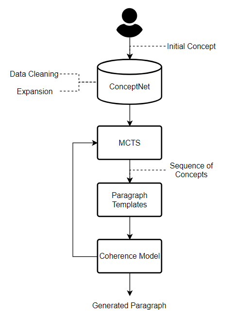

# Overview

  

The objective of this research is to generate a coherent and understandable text.  
We extracted commonsense knowledge from [ConceptNet](https://conceptnet.io/) automatically and combined a constructed word embedding model and a designed Deep Neural Network (DNN) of discourse coherence model to evaluate the Chinese text selected by Monte-Carlo Tree Search (MCTS) algorithm.  

We [evaluate](https://github.com/play0137/Generate_coherent_text/tree/master/evaluation) generated text by human rating, and it is more coherent when using the discourse coherence model.

## Chinese ConceptNet
Please refer to [Chinese ConceptNet](https://github.com/play0137/Chinese_ConceptNet).

## Models
- [Word embedding model](https://github.com/play0137/Traditional_Chinese_word_embedding#chinese-word-embeddings)
- [Discourse coherence model](https://mega.nz/file/vcAXzByB#qjZLRfwJ523rTlYvdY-h_gIFsk0hKzJNuiqHrBJDSx0)  
  A DNN model which is regarded as a reward function in MCTS.  
  The positive samples are the original paragraphs, and the negative samples are paragraphs with replacement of other connected concepts in ConceptNet.  
  The training method is in the [discourse_coherence_model](https://github.com/play0137/Generate_coherent_text/blob/master/reports/discourse_coherence_model.pdf)
  , and the experiments are in the [discourse_coherence_model_result](https://github.com/play0137/Generate_coherent_text/blob/master/reports/discourse_coherence_model_result.pdf).

# Usage

- Download models above to the .\model folder
- Create an environment with command  
  <code> conda create --name <env_name> --file requirements.txt </code>
- Run MCTS.py (It takes minutes to run the program.)
- Generated texts are in 

# Reference
  
> Ying-Ren Chen (2021). [Generate coherent text using semantic embedding, common sense templates and Monte-Carlo tree search methods](https://etd.lib.nctu.edu.tw/cgi-bin/gs32/hugsweb.cgi?o=dnthucdr&s=id=%22G021040625840%22.&searchmode=basic) (Master's thesis, National Tsing Hua University, Hsinchu, Taiwan).  

BibTeX:  
> @mastersthesis{Chen:2021:generate_coherent_text,  
&nbsp;&nbsp;&nbsp;&nbsp; author = "Ying-Ren Chen,  
&nbsp;&nbsp;&nbsp;&nbsp; title = "Generate coherent text using semantic embedding, common sense templates and Monte-Carlo tree search methods",  
&nbsp;&nbsp;&nbsp;&nbsp; school = "National Tsing Hua University",  
&nbsp;&nbsp;&nbsp;&nbsp; pages = 136,  
&nbsp;&nbsp;&nbsp;&nbsp; year = 2021  
}  
