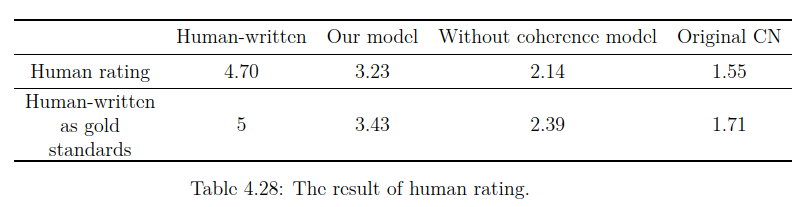

# Evaluation

  

We evaluate the generated paragraphs by human rating.  
Employee 30 web users to rate the paragraphs from 1 to 6 according to coherence, fluency and correctness.  
The paragraph with lower score is less coherent, and the one with higher score is more coherent.  
