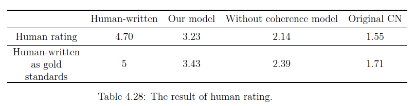
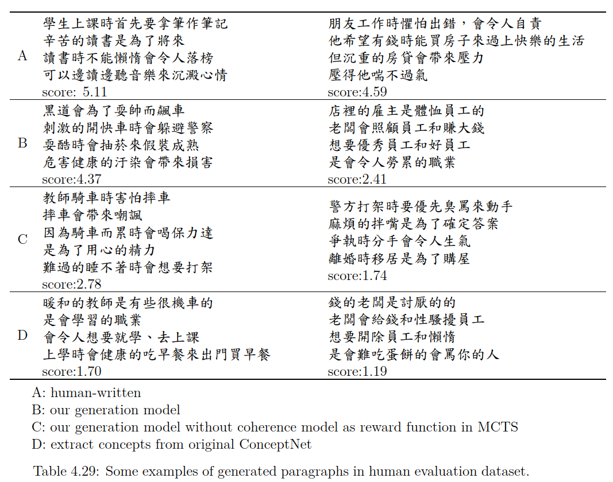

# Evaluation

  

We evaluate the generated texts by human rating.  
Employee 30 web users to rate the paragraphs from 1 to 6 according to coherence, fluency and correctness.  
The text with lower score is less coherent, and the one with higher score is more coherent.  

Because the human evaluation is subjective, everyone may have different opinions.  
Some people tend to rate higher scores, and some tend to rate lower scores.  
Therefore, the absolute scores are not very precise.  
We take the human-written texts as gold standards , and normalize the scores from 1 to 5 (the second row of table).  

## Examples

  

We list some examples which are in the human evaluation dataset.  
The examples on the left side are the highest score with that method, and the ones on the right side are the lowest score.
