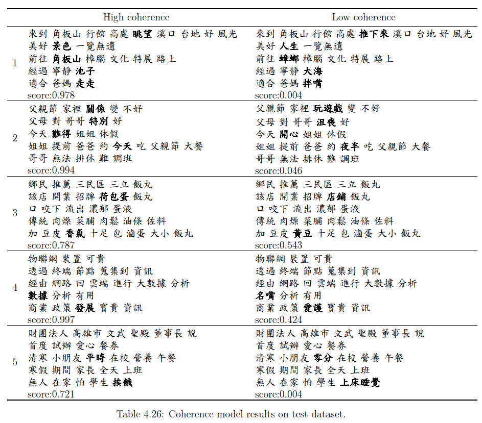

## Reports
- discourse_coherence_model.pdf: explain which copora and how to train the discourse coherence model.
- discourse_coherence_model_result.pdf: compare different hyperparameters and give some examples of generated text.
- paragraph_generation.pdf: explain how to use templates, Chinese ConceptNet and MCTS algorithm to generate text.

## System flowchart

  

User inputs an initial concept (subject), we first check whether it exists in ConceptNet or not.  
If it doesn't exist in ConceptNet, we substitute initial concept for its plesionyms or user can reinput it.  
And we adopt MCTS to simulate different combinations of concepts and evaluate coherence of generated texts by the coherence model.  
We paraphrase the texts generated by MCTS with plesionyms and pronouns, and evaluate these texts by the coherence model.  
Lastly, select one of the best results as our final output text.

## Positive and negative samples of coherence model

  

The paragraphs on the left side are the positive samples and the right side are the negative ones.  
Four or five words in the first two examples are substituted by other connected words in ConceptNet, and the coherence model can distinguish them easily.  
The rest of the examples only substitute two words, the model can still predict correctly.  
